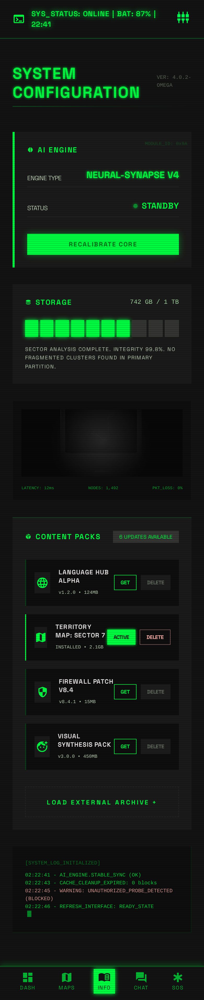
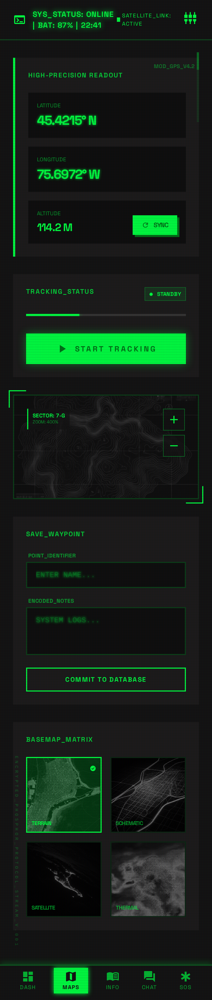
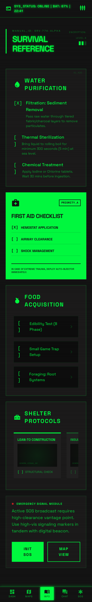

# NOMAD Android - Pip-Boy Edition

> Knowledge That Never Goes Offline

An offline-first survival knowledge app for Android, featuring on-device AI, offline maps, knowledge browsing, emergency tools, and notes — all designed to work without internet connectivity. Built with a retro-futuristic Pip-Boy terminal aesthetic inspired by Fallout 4.

<p align="center">
  
  
  
  
  
</p>

---

## Features

- **On-Device AI Chat** — Local AI powered by llama.cpp running **OpenBMB MiniCPM5-1B** (Q4_K_M GGUF, ~656 MB) with retrieval-augmented generation. Falls back to a built-in rule-based engine when no model is available. MiniCPM5-1B is the **only** model this app supports.
- **Offline Maps** — MapLibre-based mapping with MBTiles storage, GPS tracking, waypoints, and route recording.
- **Knowledge Browser** — Offline Wikipedia via Kiwix ZIM archives, bundled survival content, and content pack management.
- **Emergency Tools** — First aid guides, survival checklists, and quick-reference emergency procedures.
- **Notes** — Markdown-based note-taking with live preview, search, and offline storage.
- **Pip-Boy UI** — Retro-futuristic CRT terminal aesthetic with scanline effects, phosphor green palette, and monospace typography.

## Screenshots

| Dashboard | Maps | Chat |
|:-:|:-:|:-:|
|  |  |  |

## Architecture

**MVVM + Repository + Hilt DI**, single-module Jetpack Compose app.

```
UI (Compose Screens + ViewModels)
  ↓ StateFlow<UiState>
Repositories
  ↓
Data Sources (Room DAOs, ContentPackManager, AIEngine)
```

- **ViewModels** expose `StateFlow<XxxUiState>` — screens collect via `collectAsStateWithLifecycle()`
- **Repositories** wrap DAOs/managers and return `Result<T>` (custom sealed class)
- **Hilt modules** in `di/` handle all dependency injection
- **Room database** (v6) with 9 entities and 5 migrations

### AI Engine System

Three implementations behind a common `AIEngine` interface:

| Engine | Description |
|--------|-------------|
| `LlamaCppEngine` | On-device inference via a vendored llama.cpp build (`libnomad_llm.so`). Runs exactly one model — **OpenBMB MiniCPM5-1B** (Q4_K_M GGUF, ~656 MB). |
| `RAGEngine` | Retrieval-augmented generation wrapper around any AIEngine. |
| `FallbackEngine` | Rule-based responses for survival topics — no model required. |

> **Single-model policy.** This app installs and runs only [`openbmb/MiniCPM5-1B`](https://huggingface.co/openbmb/MiniCPM5-1B). The GGUF artifact (`MiniCPM5-1B-Q4_K_M.gguf`, ~656 MB) is downloaded from the official sibling repo [`openbmb/MiniCPM5-1B-GGUF`](https://huggingface.co/openbmb/MiniCPM5-1B-GGUF), because llama.cpp requires a GGUF file and the base repo ships `safetensors` weights only. There is no vision/multimodal ("-V") model involved.

### Navigation

Eight routes via Compose Navigation: Dashboard, Maps, Knowledge, Chat, Notes, Note Editor, Emergency, Settings.

## Tech Stack

| Layer | Technology |
|-------|-----------|
| UI | Jetpack Compose, Material 3 |
| DI | Hilt (KSP) |
| Database | Room (KSP) |
| Maps | MapLibre Native |
| AI | llama.cpp (GGUF) — OpenBMB MiniCPM5-1B |
| Networking | OkHttp |
| Language | Kotlin 2.0.21 |
| Build | Gradle 8.13, AGP 8.13.2 |

## Getting Started

### Prerequisites

- JDK 17 (Temurin recommended)
- Android SDK API 35, Build Tools 35.0.0
- Android Studio (latest stable)

### Build

```bash
# Clone the repo
git clone https://github.com/raulvidis/nomad-android.git
cd nomad-android

# Build debug APK
./gradlew assembleDebug

# Run unit tests
./gradlew testDebugUnitTest

# Run lint
./gradlew lint

# Clean build
./gradlew clean assembleDebug
```

The debug APK will be at `app/build/outputs/apk/debug/nomad-android-<version>.apk`
(e.g. `nomad-android-1.0.0.apk`). Install it with `adb install app/build/outputs/apk/debug/nomad-android-*.apk`.

## Project Structure

```
app/src/main/java/com/nomad/android/
├── data/
│   ├── ai/              # AI engine interface + 3 implementations
│   ├── content/          # Content pack + Kiwix ZIM management
│   ├── local/            # Room DB, DAOs, entities
│   ├── maps/             # Tile calculation, MBTiles, offline tiles
│   └── repository/       # Repository layer (7 repositories)
├── di/                   # Hilt modules (Database, AI, Maps, Repository)
├── ui/
│   ├── theme/            # Color, typography, CRT terminal effects
│   ├── components/       # Reusable terminal-styled components
│   ├── navigation/       # Routes + NavHost
│   ├── dashboard/        # Dashboard screen
│   ├── maps/             # Offline maps screen
│   ├── knowledge/        # Knowledge browser screen
│   ├── chat/             # AI chat terminal screen
│   ├── emergency/        # Emergency tools screen
│   ├── notes/            # Notes list + editor screens
│   ├── settings/         # Settings screen
│   └── onboarding/       # First-run boot sequence
└── util/                 # Location tracking service
```

## CI

GitHub Actions runs on every push/PR to `main`:

1. **Lint** — `./gradlew lint`
2. **Unit Tests** — `./gradlew testDebugUnitTest`
3. **Build** — `./gradlew assembleDebug`

## Fonts

This project bundles the following open-source fonts:

- [JetBrains Mono](https://www.jetbrains.com/lp/mono/) — Apache 2.0 License
- [Space Grotesk](https://fonts.google.com/specimen/Space+Grotesk) — SIL Open Font License 1.1

## Attribution

This project was inspired by [Project N.O.M.A.D.](https://github.com/Crosstalk-Solutions/project-nomad) by [Crosstalk Solutions](https://github.com/Crosstalk-Solutions) — a self-contained offline survival server. The Android port is an independent implementation sharing the same mission of making critical knowledge available without internet connectivity.

## License

```
Copyright 2025-present raulvidis

Licensed under the Apache License, Version 2.0 (the "License");
you may not use this file except in compliance with the License.
You may obtain a copy of the License at

    http://www.apache.org/licenses/LICENSE-2.0

Unless required by applicable law or agreed to in writing, software
distributed under the License is distributed on an "AS IS" BASIS,
WITHOUT WARRANTIES OR CONDITIONS OF ANY KIND, either express or implied.
See the License for the specific language governing permissions and
limitations under the License.
```
